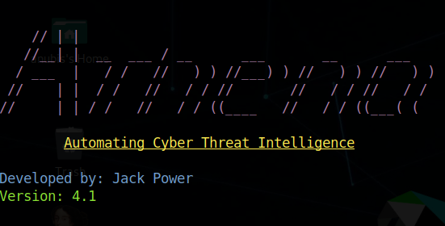
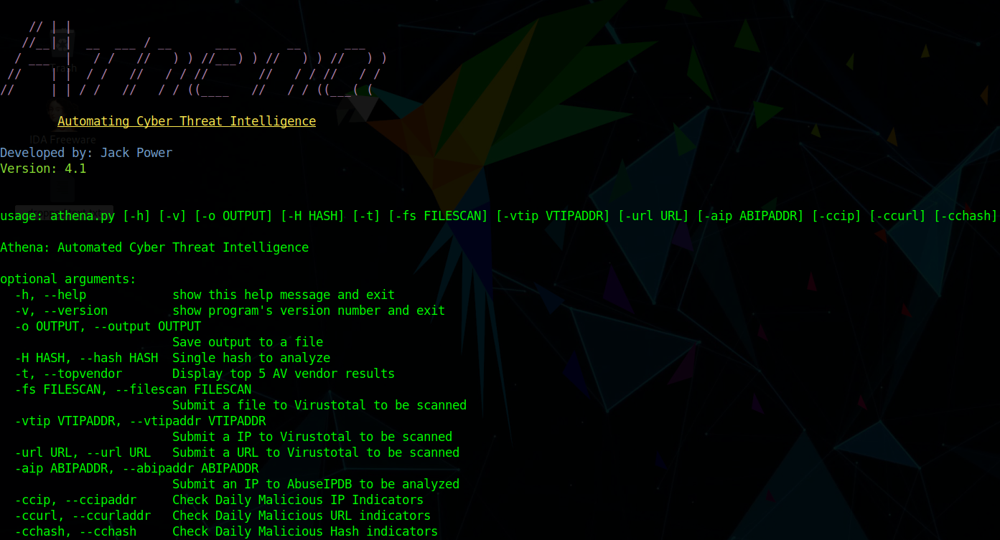
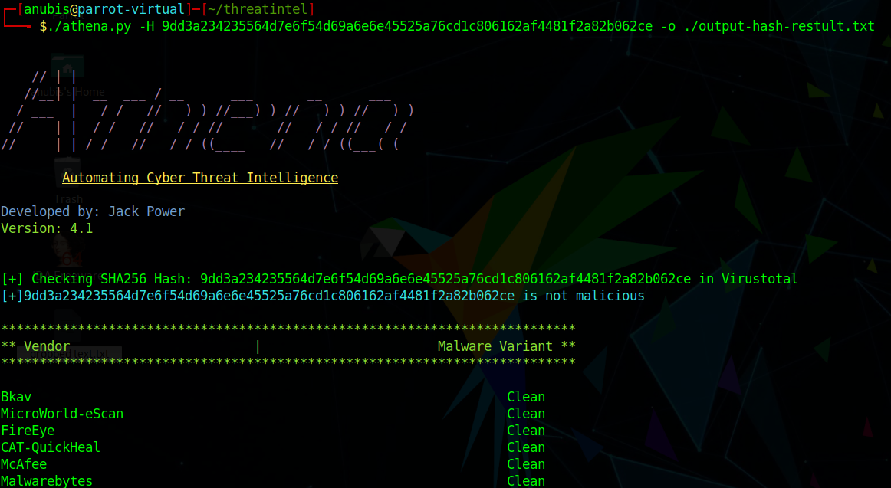
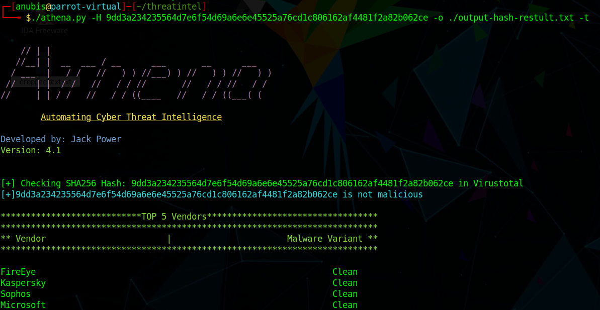
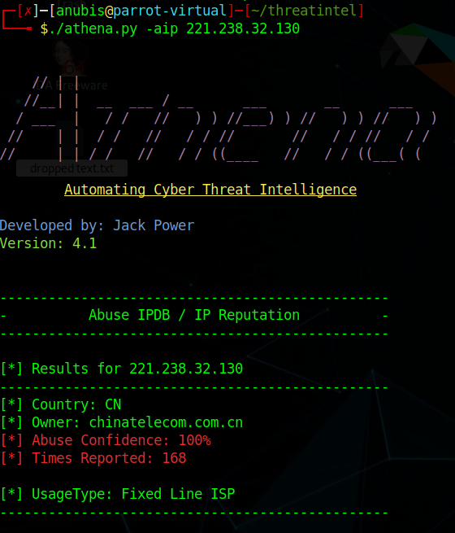
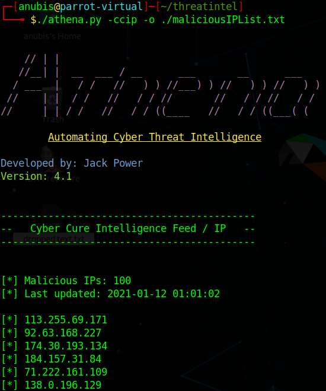

# Athena

<b>Automated Tool for Cyber Threat Intelligence</b>

<b>Athena</b> <i>Version 4.0</i> can be used for automated Threat Intelligence lookups. You can perform the following functions:

1) Virustotal Hash scan 
2) Virustotal file upload
3) Virustotal IP Lookup
4) AbuseIPDB Lookup
5) Cybercure.ai Threat Intelligence lookups for Malicious IP/URL/Hash

Each of the above allows the user to quickly and efficiently check for malicious content and receive a CLI output aswell as save the results to an output file. 

<b>-H / --hash</b> -> Input a hash value to scan on virus total 

<b> -fs / --filescan</b> -> Upload a file to virustotal 

<b> -o / --output</b> -> Output the results to a user-specified file

<b> -t / --topvendors</b> -> Display the Top 5 Anti-virus vendor results

<b> -vtip / --vtipaddr </b> -> Scan an IP address / Find any malicious samples or domains related to an IP

<b> -aip / --aipaddr </b> -> Scan an IP address with AbuseIPDB for malicious confidence and past malicious activity related to a specific IP

<b> -ccip / --ccipaddr </b> -> Check for daily malicious IPs via Cybercure.ai

<b> -ccurl / --ccurladdr </b> -> Check for daily malicious URLs via Cybercure.ai

<b> -cchash / --cchash </b> -> Check for daily malicious Hashs via Cybercure.ai

